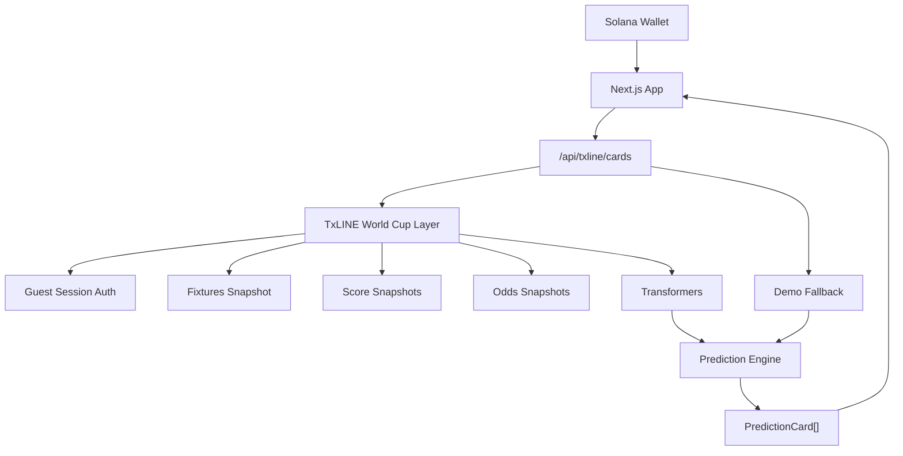

# SolGoal

TxLINE World Cup Hackathon submission for the **Consumer & Fan Experiences** track.

SolGoal is the fastest way to test football intuition during a live World Cup match. Fans connect a Solana wallet, swipe through live prediction cards powered by TxLINE fixtures, scores, events, and consensus odds, and build a Sports IQ.

SolGoal is not a betting platform. It has no deposits, wagers, cash-out, trading, or real-money prediction mechanics.

## Problem

World Cup data is rich, but fan products often turn it into dense tables and feeds. Casual fans need something faster during a match: one moment, one prediction, one instinctive answer.

## Solution

SolGoal turns live TxLINE data into simple prediction cards:

- `LOCK IT` when the fan agrees
- `NO WAY` when the fan disagrees
- Sports IQ tracks intuition over time
- Local history is scoped to the connected Solana wallet

## Architecture



## Folder Structure

```txt
src/app/api/txline
  cards/route.ts      Main frontend-safe prediction feed
  matches/route.ts    Normalized matches only
  events/route.ts     Normalized events only
  odds/route.ts       Normalized odds only

src/lib/txline
  client.ts           Authenticated TxLINE client
  worldcup.ts         Official World Cup data orchestration
  transformers.ts     Raw TxLINE to normalized domain objects
  adapter.ts          Prediction generation engine
  demo.ts             Demo-mode World Cup simulation
  cache.ts            Lightweight request cache and dedupe
  errors.ts           Centralized logging and safe errors
  types.ts            Domain and response types
```

## User Flow

1. Fan opens SolGoal.
2. Fan connects Phantom, Solflare, or another Solana wallet supported by Solana Wallet Adapter.
3. SolGoal fetches prediction cards from `/api/txline/cards`.
4. Fan swipes or taps `LOCK IT` / `NO WAY`.
5. Picks are saved in localStorage by wallet address.
6. Results show Sports IQ, accuracy, streak, pending picks, and leaderboard preview.
7. History shows previous picks grouped by match.

## TxLINE Integration Flow

SolGoal uses the official TxLINE World Cup and Quickstart documentation:

- `POST {TXLINE_BASE_URL}/auth/guest/start`
- `GET {TXLINE_BASE_URL}/api/fixtures/snapshot?startEpochDay={epochDay}`
- `GET {TXLINE_BASE_URL}/api/scores/snapshot/{fixtureId}`
- `GET {TXLINE_BASE_URL}/api/odds/snapshot/{fixtureId}`

The server starts a guest session, caches the session token briefly, and sends authenticated requests with:

- `Authorization: Bearer <guest-session-jwt>`
- `X-Api-Token: <TXLINE_API_TOKEN>`

The browser never receives TxLINE credentials or raw TxLINE payloads.

## Prediction Generation Flow

Input:

- World Cup fixtures
- score snapshots
- live status and match minute
- event/actions snapshots
- consensus odds snapshots

Output:

- `PredictionCard[]`

The prediction engine creates fan-readable cards such as:

- Argentina wins
- Brazil scores next
- One more goal before full time
- No more goals
- Over 2.5 goals
- Draw at full time
- France keeps a clean sheet
- England responds after conceding
- Brazil survives with 10 men
- One more corner before full time

The UI never sees sportsbook terminology or raw odds schemas.

## Polling

The `/api/txline/cards` route returns `pollAfterMs`.

- live matches: 10 seconds
- upcoming matches: 30 seconds
- finished-only state: 60 seconds

The browser pauses polling while the tab is hidden and resumes when focused.

## Demo Mode

Demo mode automatically activates when:

- `NEXT_PUBLIC_ENABLE_DEMO_MODE=true`
- TxLINE credentials are missing
- TxLINE is unavailable
- a request is rate limited
- a response cannot be transformed safely

Demo mode simulates:

- match minute movement
- goals
- red cards
- penalties
- half time
- odds movement
- late pressure
- realistic prediction cards

The product remains usable during judging even if no live match is active.

## Environment Variables

```env
TXLINE_API_TOKEN=
TXLINE_BASE_URL=https://txline.txodds.com
NEXT_PUBLIC_ENABLE_DEMO_MODE=false
```

Optional:

```env
NEXT_PUBLIC_SOLANA_RPC_URL=
SOLANA_RPC_URL=
SOLANA_PRIVATE_KEY=
TXLINE_SERVICE_LEVEL=12
TXLINE_DURATION_WEEKS=4
TXLINE_SELECTED_LEAGUES=
```

## TxLINE Setup Utility

The repository includes a CLI utility for the official TxLINE setup flow:

```bash
npm run txline:setup
```

The utility:

- loads `.env.local`
- connects a Solana mainnet wallet from `SOLANA_PRIVATE_KEY`
- checks SOL balance for transaction fees
- subscribes to the free World Cup service level through the documented Anchor program
- requests a guest JWT from `POST /auth/guest/start`
- signs `txSig:selectedLeagues:jwt`
- activates the API token through `POST /api/token/activate`
- saves `TXLINE_API_TOKEN=<token>` to `.env.local`
- verifies the token against `GET /api/fixtures/snapshot`

Required setup utility dependencies are listed in `package.json`:

- `@coral-xyz/anchor`
- `@solana/web3.js`
- `@solana/spl-token`
- `axios`
- `dotenv`
- `tweetnacl`

## Running Locally

```bash
npm install
npm run dev
```

Open `http://localhost:3000`.

## Deployment

Deploy on Vercel or any Next.js-compatible host.

Required production environment variables:

- `TXLINE_API_TOKEN`
- `TXLINE_BASE_URL`
- `NEXT_PUBLIC_ENABLE_DEMO_MODE=false`

Do not expose `TXLINE_API_TOKEN` as a public environment variable.

## Business Model

SolGoal can expand commercially without betting mechanics:

- sponsored daily challenges
- premium Sports IQ analytics
- fan streak cosmetics
- creator prediction battles
- team-based leaderboards
- fantasy football integrations

## Technical Decisions

- Next.js API routes keep TxLINE credentials server-side.
- A dedicated TxLINE layer isolates auth, request caching, transforms, and prediction generation.
- localStorage keeps the MVP database-free while preserving wallet-scoped history.
- Solana wallet connection is used as portable fan identity, not for transactions.
- Demo fallback is part of production reliability, not a mock-only prototype.

## TxLINE Feedback

What worked well:

- The fixtures, score snapshots, and odds snapshots map cleanly into a live prediction-card experience.
- The free World Cup tier is a strong fit for consumer fan products because it includes fixtures, scores, and odds needed for real-time interaction.
- Per-fixture score and odds snapshots make it easy to prioritize live matches and keep the feed focused.

What was difficult:

- The app has to defensively normalize different shapes for teams, status, clocks, score actions, and odds markets.
- Odds data can appear as market/outcome arrays rather than simple fields, so the adapter accepts both.
- Live match availability is unpredictable during judging, making demo fallback essential.

Most useful schema:

- The odds snapshot schema is the most useful for SolGoal because match-winner, total-goals, both-teams-to-score, and next-goal data create clear one-swipe decisions.

## Future Roadmap

- signed fan sessions
- verifiable prediction history on Solana
- creator prediction battles
- team fan leaderboards
- fantasy football integrations
- richer Sports IQ analytics

## Known Limitations

- No backend database; history is local to the browser and wallet.
- Real pick settlement depends on final match results and market-specific resolution logic.
- Demo mode is intentionally retained for judging and live-match gaps.

## Legal Disclaimer

SolGoal is a football prediction game, not a betting platform. It does not accept deposits, wagers, or real-money predictions. It has no cash-out, trading, or payment mechanics.
